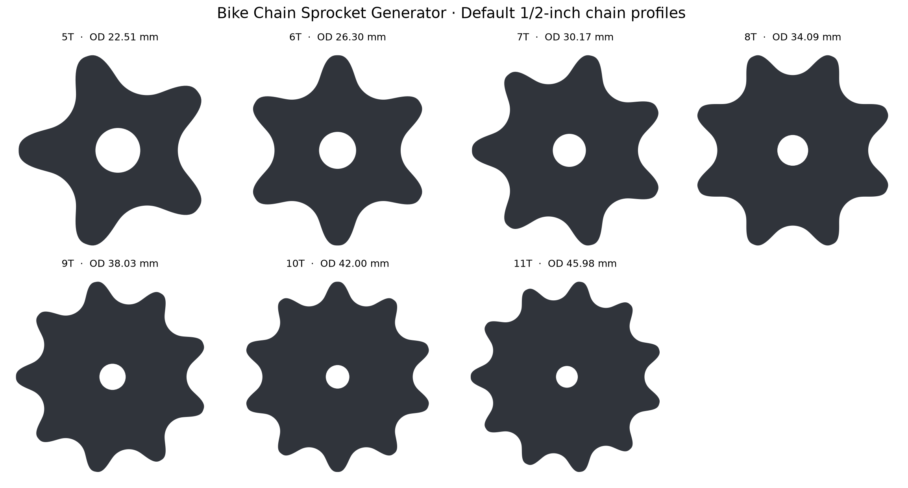

# Bike Chain Sprocket Generator – Blender Add-on

Parametrischer Blender-Generator für Fahrrad- und Motorrad-Kettenräder ab fünf Zähnen.

[**Aktuelles Add-on als ZIP herunterladen**](https://github.com/EricRorich/BikeChainWheel/releases/latest/download/bike_chain_sprocket.zip)


Dieses Blender-Add-on erzeugt parametrische Kettenräder für Fahrradketten, einschließlich sehr kleiner Varianten mit **5 bis 11 Zähnen**. Anders als Blenders allgemeiner Gear-Generator basiert das Zahnprofil auf der Kettengeometrie:

- Teilungskreis aus Kettenteilung und Zahnzahl
- kreisförmige Rollenmulden für die Kettenrollen
- C2-stetige quintische Hermite-Übergänge von den Mulden zu den Zahnspitzen
- gleichgerichtete tangentiale Verformung der Zahnspitzen
- optional gerade, tangential abgeflachte Zahnspitzen
- geschlossener, manifold Mesh-Körper mit mittiger Bohrung
- optionale, nicht-destruktive Kantenfase

## Installation

1. Unter [Releases](https://github.com/EricRorich/BikeChainWheel/releases) die Datei `bike_chain_sprocket.zip` herunterladen.
2. In Blender **Edit → Preferences → Add-ons** öffnen.
3. Je nach Blender-Version **Install…** oder **Install from Disk…** wählen.
4. `bike_chain_sprocket.zip` auswählen und das Add-on aktivieren.
5. Im 3D Viewport: **Shift+A → Mesh → Bicycle Chain Sprocket**.
6. Parameter direkt im Erzeugungsdialog oder über **F9 / Adjust Last Operation** ändern.

## Chain Size Presets

`Chain Size Preset` lädt Kettenteilung, Rollendurchmesser und eine konservative Ausgangsdicke für das Ritzel. Die vorgeschlagene Ritzeldicke liegt bewusst etwas unter der nominalen inneren Kettenbreite, damit seitliches Spiel bleibt.

| Preset | Pitch | Roller | vorgeschlagene Ritzeldicke |
|---|---:|---:|---:|
| Bicycle 1/8" – Single-speed/BMX | 12,700 mm | 7,750 mm | 2,80 mm |
| Bicycle 3/32" – Derailleur | 12,700 mm | 7,750 mm | 2,00 mm |
| Bicycle 11/128" – Narrow 10–12 speed | 12,700 mm | 7,750 mm | 1,80 mm |
| Motorcycle 415 | 12,700 mm | 7,770 mm | 4,30 mm |
| Motorcycle 420 | 12,700 mm | 7,770 mm | 5,80 mm |
| Motorcycle 428 | 12,700 mm | 8,510 mm | 7,30 mm |
| Motorcycle 520 | 15,875 mm | 10,160 mm | 5,80 mm |
| Motorcycle 525 | 15,875 mm | 10,160 mm | 7,30 mm |
| Motorcycle 530 | 15,875 mm | 10,160 mm | 8,80 mm |
| Custom | frei | frei | frei |

Nach Auswahl eines Presets bleiben die einzelnen Werte editierbar. Für eine konkrete Kette müssen vor Fertigung immer das Datenblatt des Herstellers und ein reales Kettenmuster geprüft werden; besonders Rollen- und Innenbreiten können durch Baureihe, Dichtungsart und Hersteller leicht variieren.



## Sinnvolle Startwerte für Fahrradketten

| Parameter | Startwert | Bedeutung |
|---|---:|---|
| Teeth | 5 | geometrisch unterstützt ab 5; Warnung bis 8T |
| Chain Pitch | 12,7 mm | Standard-Fahrradkette: 1/2 Zoll |
| Roller Diameter | 7,75 mm | typischer Rollendurchmesser |
| Roller Clearance | 0,15 mm | zusätzliches radiales Spiel |
| Tooth Height | 0,45 mm | Zahnspitze über dem Teilkreis |
| Tooth Tip Pitch | 1,5° | Ober- und Unterseite gemeinsam in eine Richtung |
| Tooth Tip Flattening | 0,0 mm | radiale Tiefe der geraden Abflachung |
| Thickness | 2,0 mm | an Ketteninnenbreite und Material anpassen |
| Bore Diameter | 5,0 mm | runde Mittelbohrung |
| Scale | 1,0 | gleichmäßige Skalierung aller Maße |
| Profile Resolution | 32 | Punkte pro Zahn |
| Edge Bevel | 0,10 mm | nicht-destruktiver Bevel Modifier |

Die mitgelieferte Referenzkassette hat beim 11-Zahn-Ritzel ungefähr 45,98 mm Außendurchmesser. Das Add-on erzeugt mit den Standardwerten ebenfalls etwa **45,98 mm**; Zahnzahl, Teilung und Rollensitz sind dabei vollständig parametrisch.

## Ausgabedaten

Das Objekt wird in realen metrischen Abmessungen erzeugt. Millimeterwerte werden unter Berücksichtigung von Blenders `Unit Scale` in Blender-Einheiten umgerechnet. Zusätzlich speichert das Objekt folgende Custom Properties:

- `teeth`
- `chain_preset`
- `overall_scale`
- `chain_pitch_mm`
- `roller_diameter_mm`
- `tooth_tip_pitch_degrees`
- `tooth_tip_flattening_mm`
- `pitch_diameter_mm`
- `outside_diameter_mm`
- `profile_type`

## Wichtige Hinweise

- 5–8 Zähne verursachen extreme Kettengelenkwinkel und einen sehr starken Polygoneffekt. Dies ist nur das geometrisch unterstützte Minimum, nicht die Empfehlung für einen normalen Fahrradantrieb. Blender zeigt dafür eine Warnung an.
- `Tooth Tip Pitch` verschiebt Ober- und Unterseite jeder Zahnspitze gemeinsam in dieselbe tangentiale Richtung. Die Zahnflanken werden dadurch leicht asymmetrisch, während die kreisförmigen Rollenmulden unverändert bleiben. Positive und negative Werte wechseln die Richtung.


- `Tooth Tip Flattening` schneidet die runde Spitze um den eingegebenen Millimeterwert zurück. Die entstehende Kante ist eine echte gerade Tangentialfläche. `0,0 mm` deaktiviert die Abflachung; etwa `0,15–0,30 mm` ist ein sinnvoller Startbereich.


- `Scale` skaliert auch Kettenteilung, Rollensitze, Bohrung, Dicke und Bevel. Für eine reale 1/2-Zoll-Fahrradkette muss der Wert normalerweise `1,0` bleiben; andere Werte sind für Miniaturen, Prototypen oder komplett mitskalierte Ketten gedacht.
- Das Add-on bildet keine Schalthilfen, asymmetrischen Zahnkürzungen oder Shimano/SRAM-Kassettenverzahnungen nach. Diese Details der STEP-Referenz sind für ein einfaches einzelnes Kleinritzel nicht erforderlich.
- Die Mittelaufnahme ist absichtlich eine frei einstellbare runde Bohrung. Spezielle Wellenprofile können anschließend separat modelliert oder per Boolean ausgeschnitten werden.
- Vor Fertigung oder Belastungseinsatz müssen Kettenbreite, Toleranzen, Material, Achsaufnahme und Festigkeit geprüft werden.

## Entwicklungstest

Im Projektordner wurde das Add-on mit Blenders Python-API getestet:

```bash
blender --background --python tests/run_blender_tests.py
```

Der Test registriert das Add-on, erzeugt 5T bis 11T und prüft zusätzlich alle neun Fahrrad-/Motorrad-Presets samt `Custom`, geschlossene Kanten, positive Volumenorientierung, Soll-Außendurchmesser, exakte Rollensitze, `Unit Scale`, Gesamt-`Scale`, 6° `Tooth Tip Pitch`, eine echte gerade 0,30-mm-Abflachung, den ausgewerteten Bevel Modifier sowie die Ablehnung zu großer Bohrungen.
