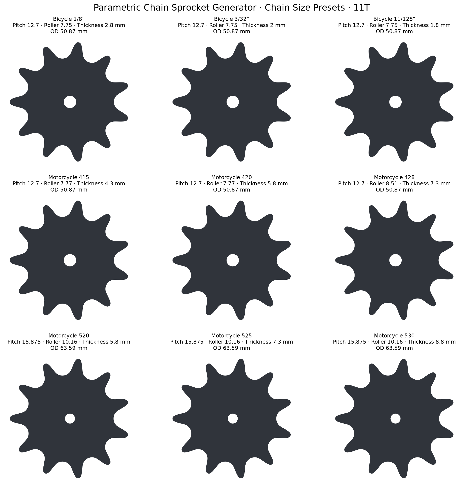
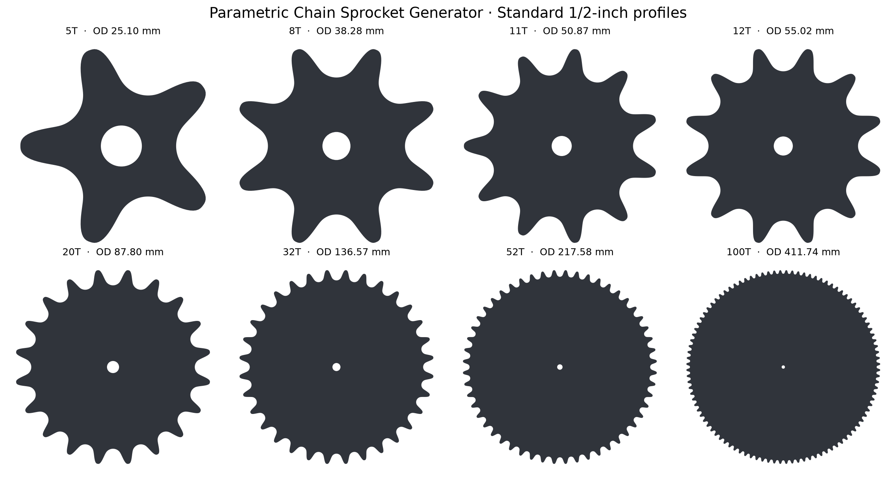
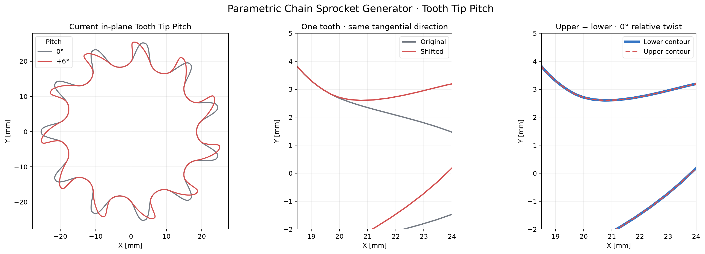
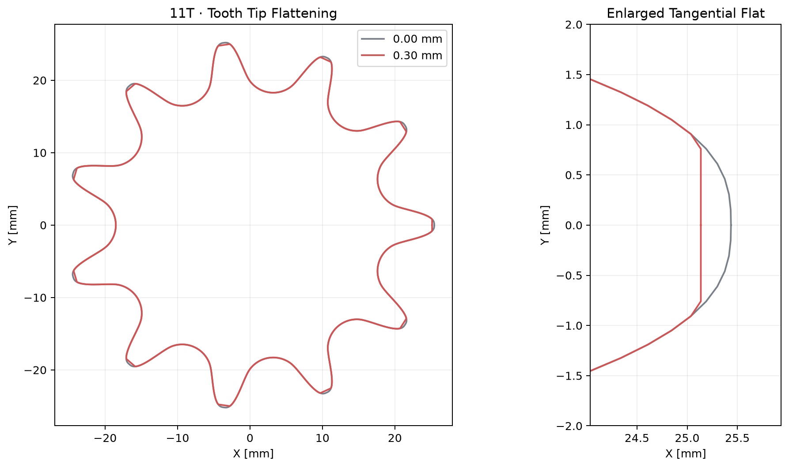
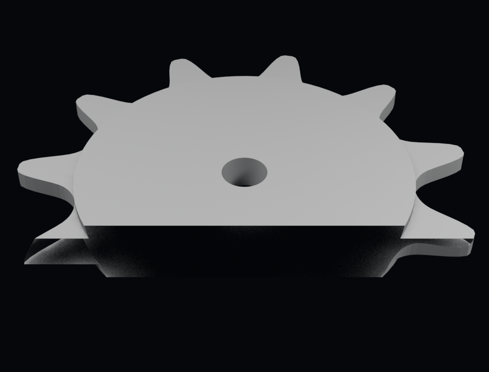

# Parametric Chain Sprocket Generator – Blender Add-on

A parametric Blender generator for bicycle and motorcycle chain sprockets with five or more teeth.

[**Download the latest add-on ZIP**](https://github.com/EricRorich/ParametricChainSprocketGenerator/releases/latest/download/parametric_chain_sprocket.zip)



Unlike Blender's general-purpose gear generator, this add-on builds sprockets from roller-chain geometry:

- pitch circle calculated from chain pitch and tooth count
- tooth-count-dependent standard outside diameter
- circular roller seats
- C2-continuous quintic Hermite transitions from roller seats to tooth tips
- directional tooth-tip pitch with matching upper and lower contours
- optional straight tangential tooth-tip flattening
- optional raised chain-support platform with adjustable rim and height
- closed manifold mesh with a circular center bore
- optional non-destructive edge bevel

## Installation

1. Download `parametric_chain_sprocket.zip` from the [Releases page](https://github.com/EricRorich/ParametricChainSprocketGenerator/releases).
2. Open **Edit → Preferences → Add-ons** in Blender.
3. Choose **Install…** or **Install from Disk…**, depending on your Blender version.
4. Select `parametric_chain_sprocket.zip` and enable the add-on.
5. In the 3D Viewport, choose **Shift+A → Mesh → Parametric Chain Sprocket**.
6. Adjust the parameters during creation or reopen them with **F9 / Adjust Last Operation**.

When upgrading from version 1.6.x or earlier, disable and remove the old **Bike Chain Sprocket Generator** add-on before installing 1.7.0. The Python package name changed, so Blender otherwise treats the old and new packages as separate add-ons.

The installable add-on targets Blender 3.6 and newer. The optional `.blend` demonstration files attached to releases are saved with Blender 4.2 LTS and therefore require Blender 4.2 or newer to open.

## Chain Size Presets

`Chain Size Preset` loads chain pitch, roller diameter, and a conservative starting thickness for the sprocket. The suggested sprocket thickness is intentionally smaller than the nominal chain inner width to preserve lateral clearance.

| Preset | Pitch | Roller | Suggested sprocket thickness |
|---|---:|---:|---:|
| Bicycle 1/8" – Single-speed/BMX | 12.700 mm | 7.750 mm | 2.80 mm |
| Bicycle 3/32" – Derailleur | 12.700 mm | 7.750 mm | 2.00 mm |
| Bicycle 11/128" – Narrow 10–12 speed | 12.700 mm | 7.750 mm | 1.80 mm |
| Motorcycle 415 | 12.700 mm | 7.770 mm | 4.30 mm |
| Motorcycle 420 | 12.700 mm | 7.770 mm | 5.80 mm |
| Motorcycle 428 | 12.700 mm | 8.510 mm | 7.30 mm |
| Motorcycle 520 | 15.875 mm | 10.160 mm | 5.80 mm |
| Motorcycle 525 | 15.875 mm | 10.160 mm | 7.30 mm |
| Motorcycle 530 | 15.875 mm | 10.160 mm | 8.80 mm |
| Custom | user-defined | user-defined | user-defined |

All individual values remain editable after loading a preset. Before manufacturing, always verify the dimensions against the exact chain manufacturer's data sheet and a physical chain sample. Roller and inner widths may vary slightly by manufacturer, product series, and O-ring/X-ring construction.



## Tooth-Count Dimensions

For chain pitch `p` and tooth count `N`, the generator uses the exact pitch-circle relation
`Dp = p / sin(π/N)`. The default outside diameter is derived independently with the common
roller-chain sprocket relation `Do = p × (0.6 + cot(π/N))`. `Tooth Height Adjustment` is a
signed radial offset from that default; leave it at `0.0 mm` for the calculated diameter.

| Teeth | Pitch diameter | Default outside diameter |
|---:|---:|---:|
| 11T | 45.078 mm | 50.872 mm |
| 12T | 49.069 mm | 55.017 mm |
| 20T | 81.184 mm | 87.805 mm |
| 32T | 129.569 mm | 136.565 mm |
| 52T | 210.340 mm | 217.576 mm |
| 100T | 404.320 mm | 411.741 mm |

These values describe a general-purpose roller-chain sprocket profile, not proprietary shortened
cassette teeth, shifting ramps, or manufacturer-specific tooth modifications.

## Recommended Starting Values

| Parameter | Default | Meaning |
|---|---:|---|
| Teeth | 5 | Geometric minimum; warning shown through 8T |
| Chain Pitch | 12.7 mm | Standard 1/2-inch bicycle chain pitch |
| Roller Diameter | 7.75 mm | Typical bicycle-chain roller diameter |
| Roller Clearance | 0.15 mm | Additional radial clearance around each roller |
| Tooth Height Adjustment | 0.0 mm | Signed radial offset from the calculated outside diameter |
| Tooth Tip Pitch | 1.5° | Upper and lower contours move together in one direction |
| Tooth Tip Flattening | 0.0 mm | Radial depth of the straight flat cap |
| Thickness | 2.0 mm | Match to chain inner width and manufacturing clearance |
| Bore Diameter | 5.0 mm | Circular center bore |
| Scale | 1.0 | Uniform scale for every generated dimension |
| Generate Chain Support | enabled | Integrate a raised annular platform for the chain |
| Support on Both Sides | disabled | Add the same integrated platform to both sprocket faces |
| Support Height | 1.0 mm | Platform height above the sprocket face |
| Support Rim Offset | 0.0 mm | Signed radius adjustment from the roller-seat roots |
| Profile Resolution | 32 | Profile vertices per tooth |
| Edge Bevel | 0.10 mm | Non-destructive Bevel modifier |

## Generated Object Data

The mesh is generated at real metric dimensions and respects Blender's `Unit Scale`. The object stores these custom properties:

- `teeth`
- `chain_preset`
- `overall_scale`
- `chain_pitch_mm`
- `roller_diameter_mm`
- `tooth_height_adjustment_mm`
- `generate_chain_support`
- `support_height_mm`
- `support_rim_offset_mm`
- `support_outer_radius_mm`
- `support_both_sides`
- `tooth_tip_pitch_degrees`
- `tooth_tip_flattening_mm`
- `pitch_diameter_mm`
- `outside_diameter_mm`
- `profile_type`

## Tooth-Tip Controls

### Tooth Tip Pitch

`Tooth Tip Pitch` shifts the upper and lower contour of every tooth tip together in the same tangential direction. This produces slightly asymmetric tooth flanks while leaving the circular roller seats unchanged. Positive and negative values reverse the direction.



### Tooth Tip Flattening

`Tooth Tip Flattening` trims the rounded tip by the entered radial amount. The resulting cap is a true straight tangent line rather than a constant-radius arc. `0.0 mm` disables flattening; approximately `0.15–0.30 mm` is a useful starting range.



## Chain Support

`Generate Chain Support` extrudes a raised annular platform above one sprocket face. The platform is unioned into the sprocket during creation, so the result is **one connected, watertight mesh object** with no overlapping helper object. It shares the same center bore, placement, rotation, unit conversion, and overall scale and is ready for normal 3D-print export.

At the default `0.0 mm` rim offset, the outer edge lies exactly on the roller-seat root circle. This supports the inner side of the chain while keeping the roller-clearance circles unobstructed. Use `Support Rim Offset` to move the edge outward with a positive value or inward with a negative value. `Support Height` controls how far the platform rises above the sprocket face.

Enable `Support on Both Sides` to integrate the same platform into both sprocket faces. Single-sided and bilateral variants remain one connected, watertight mesh object.



`Reset All Settings`, at the bottom of the creation panel, restores every sprocket, support, mesh-quality, and placement setting to its default.

## Important Notes

- Sprockets with 5–8 teeth cause extreme chain articulation and strong polygonal action. Five teeth is only the geometric minimum supported by the generator, not a recommendation for a normal bicycle or motorcycle drivetrain.
- `Scale` also scales chain pitch, roller seats, bore, thickness, flattening, support dimensions, and bevel. Keep it at `1.0` for a real chain unless the entire mechanism is scaled.
- `Scale` accepts values up to `1000.0` for very large visual or fabrication variants.
- The add-on does not reproduce proprietary shifting ramps, asymmetric shortened teeth, or Shimano/SRAM cassette spline interfaces.
- The center mount is intentionally a configurable circular bore. Add specialized shaft or spline profiles separately.
- Verify chain width, tolerances, material, mounting geometry, tooth strength, and the exact manufacturer specification before manufacturing or load-bearing use.

## Development Test

Run the Blender API test suite from the repository root:

```bash
blender --background --python tests/run_blender_tests.py
```

The suite registers the add-on and verifies standard pitch/outside diameters through 150T, detailed 5T–11T generation, all nine bicycle/motorcycle presets and Custom mode, single-sided and bilateral integrated supports including legacy-Boolean regression cases at 8T, 12T, 16T, and 32T, default/expanded/contracted support rims, reset behavior, one-component manifold topology, positive volume orientation, exact roller seats, Blender `Unit Scale`, uniform `Scale` through the maximum value of 1000, supported 6° directional tooth-tip pitch, a true straight 0.30 mm tip flattening, evaluated Bevel modifiers, transactional Boolean-failure cleanup, and rejection of invalid bores and support rims. Release verification runs on the Blender Python 4.2 legacy `EXACT` path and Blender Python 5.0 `MANIFOLD` path.

## License

This project is licensed under the **GNU General Public License v3.0 or later**. See [LICENSE](LICENSE).
